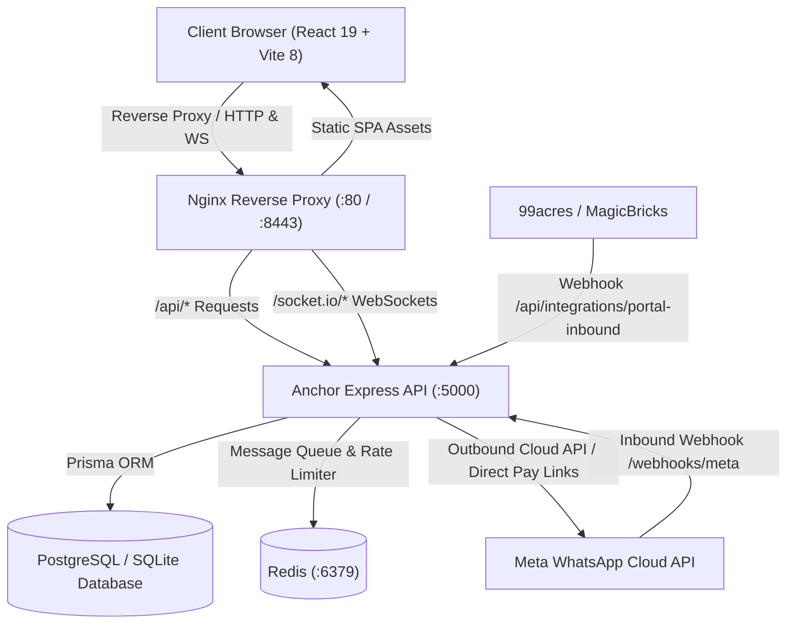

# Anchor (`Anchor.`) - Production Architecture & Deployment Guide

This guide details the complete deployment, infrastructure configuration, and handoff instructions for **Anchor (`Anchor.`)**, the high-velocity WhatsApp Revenue Recovery & Follow-Up SaaS designed for Indian SMBs.

---

## 1. System Architecture



### Track Division & Responsibilities:
- **Track 1 (Our Agent — COMPLETE):**
  - **Full Frontend Application:** All 8 primary product screens (`Dashboard`, `Inbox`, `Leads`, `Routing`, `Drip`, `Commerce`, `Analytics`, `AutoReply`, `Templates`, `Settings`, `Integrations`).
  - **Live Backend Engine:** Express + Prisma + Socket.io backend on port 5000.
  - **Live State & Persistence:** Dynamic lead creation, skill-based SLA routing, dynamic drip sequences, conversational commerce payment generation and simulation, vernacular keyword intent scoring, and role-based phone number masking.
  - **Real-Time Simulation Sandbox:** Inbound CTWA lead and customer message simulator.
- **Track 2 (Partner AI Agent):**
  - **External Connectors:** Google Sheets bidirectional 2-way sync, live 99acres / MagicBricks production webhook parsing.
  - **Live Payment Gateway:** Production Razorpay subscriptions webhook listener.
  - **Cloud Infrastructure:** VPS / Kubernetes / Docker Swarm production deployments.

---

## 2. Quickstart (Local Development)

### Prerequisites:
- Node.js >= 20.x
- npm >= 10.x

### Terminal 1: Backend Server
```bash
cd server
npm install
npm run prisma:generate
npm run prisma:push
npm run seed
npm run dev
```
*Backend runs on `http://localhost:5000` with hot-reloading via `tsx watch`.*

### Terminal 2: Frontend Client
```bash
npm install
npm run dev -- --port 8443
```
*Frontend runs on `http://localhost:8443`.*

### Seeded Demo Accounts:
| Role | Email | Password | Scope |
| :--- | :--- | :--- | :--- |
| **Owner** | `arjun@anchor.io` | `anchor123` | Full admin, billing, team & masking |
| **Manager** | `manager@anchor.io` | `anchor123` | Team oversight, SLA rules, drip builder |
| **Agent** | `sales@anchor.io` | `anchor123` | Assigned conversations & quick actions |

---

## 3. Docker Compose (1-Click Production Stack)

To run the complete stack including PostgreSQL, Redis, Anchor Backend, and Anchor Frontend with Nginx:

```bash
docker compose up -d --build
```

### Services Started:
- `anchor-frontend`: React 19 production build served via Nginx on `http://localhost:8443`.
- `anchor-backend`: Node.js Express server on `http://localhost:5000`.
- `anchor-postgres`: PostgreSQL 16 database on `localhost:5432`.
- `anchor-redis`: Redis 7 caching and queue server on `localhost:6379`.

To inspect logs:
```bash
docker compose logs -f backend
```

---

## 4. Environment Variables Reference

### Root Frontend (`.env`):
```env
VITE_API_URL=http://localhost:5000/api
VITE_WS_URL=ws://localhost:5000
PORT=8443
```

### Backend (`server/.env`):
```env
PORT=5000
NODE_ENV=production
DATABASE_URL="postgresql://anchor_user:anchor_password_2026@db:5432/anchor_db?schema=public"
REDIS_URL="redis://redis:6379"
JWT_SECRET="your_production_jwt_secret_key"
JWT_EXPIRES_IN="7d"
FRONTEND_URL="https://yourdomain.com"

# Official Meta WhatsApp Cloud API
META_VERIFY_TOKEN="anchor_meta_verify_token_2026"
META_APP_SECRET="your_meta_app_secret"
META_ACCESS_TOKEN="EAAB..."
META_PHONE_NUMBER_ID="your_phone_number_id"
META_WABA_ID="your_waba_id"
```

---

## 5. Webhooks & Inbound Routing

### 1. Meta WhatsApp Cloud API Webhook:
- **Webhook URL:** `https://yourdomain.com/api/webhooks/meta`
- **Verify Token:** Set to `META_VERIFY_TOKEN` (default: `anchor_meta_verify_token_2026`).
- **Subscription Fields:** `messages`, `message_deliveries`, `message_reads`.

### 2. Real Estate Portal Lead Ingestion (99acres / MagicBricks):
- **Webhook URL:** `POST https://yourdomain.com/api/integrations/portal-inbound`
- **Payload:**
```json
{
  "portal": "99acres",
  "leadName": "Ramesh Gupta",
  "phone": "+91 98111 22334",
  "propertyTitle": "Sector 62 Premium 3BHK",
  "budget": "1.4 Cr"
}
```
*Leads are ingested in real-time, assigned according to skill/round-robin rules, and sent immediate automated auto-replies in under 2 seconds.*
